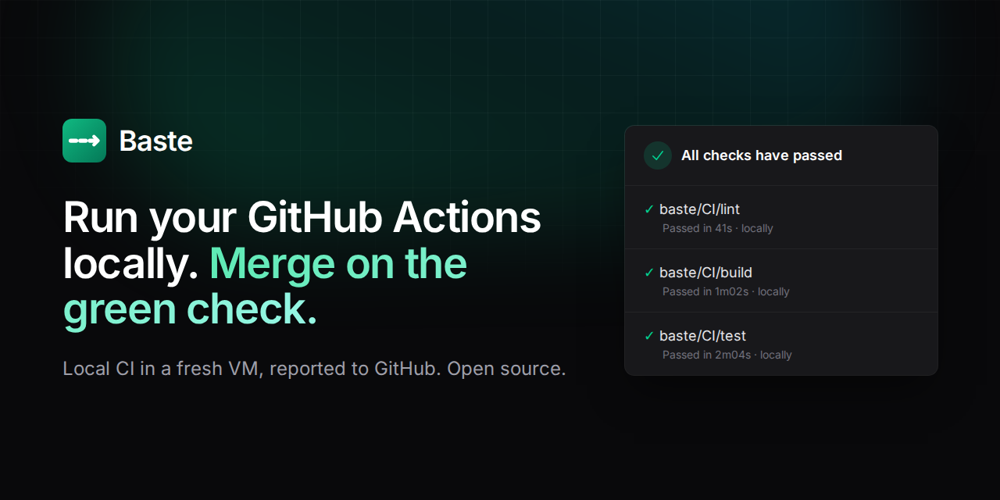

# Baste

[](https://github.com/weftsh/baste/actions/workflows/ci.yml)
[](LICENSE)
[](https://weftsh.github.io/baste/)

**Run your GitHub Actions locally. Merge on the green check.**

Baste runs the workflows you already have in a fresh Linux VM on your machine every time you `git push`, then posts each job to GitHub as a commit status that branch protection accepts. No queue, no workflow rewrites, no servers.

**[Website](https://weftsh.github.io/baste/)** · [Get started](#get-started) · [How it works](#how-it-works) · [Compatibility](docs/compatibility.md) · [Architecture](docs/architecture.md)

[](https://weftsh.github.io/baste/)

## Why Baste

Cloud CI is rented and queued, while your laptop sits mostly idle. Every push waits for a hosted runner, then bills you for the minutes.

- **Your real workflow, run faithfully.** The jobs in `.github/workflows`, in a fresh VM built like GitHub's Ubuntu runner, on the exact commit you pushed. Uncommitted edits never leak into the result.
- **A check GitHub accepts.** One commit status per job, with a stable name like `baste/CI/test` that you can make a required check. Pull requests merge on a local pass.
- **Never blocks a push.** `git push` returns right away and the run happens in the background, with a pending status on the commit within seconds.
- **Honest about what it can't run.** Windows, macOS and service-container jobs are handed to GitHub before the run starts, never half-run.
- **Zero infrastructure.** Your machine does the work, GitHub is the only backend, and your logs stay local. Free and open source.

Other local tools solve one half of the problem:

| | [act](https://github.com/nektos/act) | [gh-signoff](https://github.com/basecamp/gh-signoff) | **Baste** |
| --- | :---: | :---: | :---: |
| Runs the jobs in your workflow files | ✓ | a script you choose | ✓ |
| Each job in a fresh, runner-like VM | Docker on your host | | ✓ |
| Result shows up on the commit in GitHub | | ✓ | ✓ |
| Starts on `git push`, in the background | you run it | you run it | ✓ |

> A basting stitch is the temporary one sewn before the final seam, the way a local check comes before the merge.

## Get started

You need macOS 14+ on Apple Silicon, Linux with KVM, or Windows 11 with WSL2, plus the [GitHub CLI](https://cli.github.com) logged in (`gh auth login`). Baste uses that login and never stores a token of its own.

**1. Install Baste**

```sh
curl -fsSL https://raw.githubusercontent.com/weftsh/baste/main/install.sh | sh
```

This puts a single binary in `~/.local/bin` (the installer tells you if that isn't on your `PATH`). On macOS it also installs the Linux agent that runs inside the VMs.

**2. Set up your machine's VM backend (once)**

| Host | Backend | Setup |
| --- | --- | --- |
| macOS 14+, Apple Silicon | [Tart](https://tart.run), with Rosetta for x86_64 | `brew install cirruslabs/cli/tart`<br>`softwareupdate --install-rosetta --agree-to-license` |
| Linux (x86_64, arm64) | [Firecracker](https://firecracker-microvm.github.io) | `sudo usermod -aG kvm $USER` (then log in again)<br>install `e2fsprogs`<br>`sudo "$(command -v baste)" setup-network` |
| Windows 11 | Firecracker inside WSL2 | Set `nestedVirtualization=true` under `[wsl2]` in `%UserProfile%\.wslconfig` and run `wsl --shutdown`. Then do every step on this page inside WSL2, including the Linux setup. |

Intel Macs aren't supported.

**3. Turn it on in a repository**

```sh
cd your-repo
baste init             # checks virtualization, gh login and status permission, then installs a pre-push hook
baste image prepare    # optional: download and provision the pinned VM image now instead of on the first push
```

`baste init` checks everything before it changes anything. If something is missing, like KVM access, `gh`, or a token that can't write commit statuses, it says what's wrong and changes nothing. Run `baste doctor` any time to repeat the checks.

Want to try it before anything reaches GitHub? `baste run --no-status` runs your workflows for `HEAD` locally and posts nothing.

**4. Push**

```console
$ git push
baste: running CI for a8d31b7 (feature/login) locally in run q7hz2m; see `baste status`

$ baste status
q7hz2m  ● running  a8d31b7  feature/login  just now  push
   ✓ CI / lint                41s
   ✓ CI / build             1m02s
   ● CI / test (node 22)    1m18s  running 'npm test'
   → CI / e2e (windows)            handed to GitHub: windows-latest jobs run on GitHub

$ baste logs latest     # every step's output, live while it runs
```

Each local job shows up on the commit as `baste/<workflow>/<job>`, pending at first, then green or red with its duration and run id.

**5. Merge on a local pass**

In branch protection (or a ruleset), require the `baste/…` checks that `baste init` listed, and make the GitHub-hosted versions of those jobs optional. That's it: pull requests now merge on a local pass. To also stop spending Actions minutes on jobs that already passed, add the [gate action](#merging-on-a-local-pass).

## How it works

1. `git push`: the pre-push hook starts a run in the background, and the push completes normally.
2. A **pending** status appears on the commit for each job that runs locally, within seconds.
3. Baste reads the workflows at the pushed commit and sorts jobs by runner. `ubuntu-*` jobs run locally; Windows, macOS and self-hosted jobs are **handed to GitHub** and listed before the run starts.
4. Each job boots a **fresh VM from a pinned image digest** using copy-on-write, and checks out **the pushed commit**. Uncommitted edits never affect the result.
5. The steps run: `run:` steps, JavaScript, composite and Docker actions, matrices, `needs:`, `if:`, `env`, outputs and artifacts.
6. Each job's status flips to **success** or **failure**, with the duration and the local run id. The status links to a page that shows the `baste logs <run>` command.
7. Make those contexts required checks in branch protection, and PRs merge on a local pass.

On the first run, Baste downloads the pinned image and verifies it by digest. It then provisions the slim image once (git, build tools, Python, Node.js for JavaScript actions, Docker, and a `runner` user) and caches it locally. Later runs boot a copy-on-write clone in seconds.

## Merging on a local pass

**Default: the local status is the required check.** No workflow edits are needed. In branch protection (or a ruleset), require the `baste/<workflow>/<job>` contexts that `baste init` lists. Then make the GitHub-hosted versions of those jobs non-required, or trim their triggers.

**Opt-in: the gate action.** Add a first job to a workflow. When Baste already reported a local pass for the commit, the other GitHub-hosted jobs skip and the workflow passes in seconds. With no local status, everything runs on GitHub as usual.

```yaml
permissions:
  contents: read
  statuses: read

jobs:
  baste-gate:
    runs-on: ubuntu-latest
    outputs:
      skip: ${{ steps.gate.outputs.skip }}
    steps:
      - id: gate
        uses: weftsh/baste/gate@v1

  build:
    needs: baste-gate
    if: needs.baste-gate.outputs.skip != 'true'
    runs-on: ubuntu-latest
    steps: [...]
```

Only gate jobs that Baste runs locally (`ubuntu-*`), not Windows or macOS ones. `baste gate` prints this snippet.

## Commands

| Command | What it does |
| --- | --- |
| `baste init [--backend B]` | Check everything, then install the pre-push hook (chaining any existing one) |
| `baste doctor` | The same checks, changing nothing |
| `baste status [RUN] [--commit SHA]` | Recent runs with SHA, branch, start, duration and each job's state (queued, running, passed, failed, handed to GitHub) |
| `baste logs RUN [JOB] [--failed]` | Output per job and step, with exit codes; streams live while the run is in progress |
| `baste run [--job J] [--workflow W] [--no-status]` | Run the workflows for `HEAD` now, without pushing |
| `baste rerun RUN` | Run again on the same commit and update its statuses |
| `baste cancel RUN` | Stop a run in progress |
| `baste insights` | Time per step, local vs. GitHub duration, time and Actions minutes saved, flaky jobs |
| `baste secrets set NAME [--global]` / `list` / `rm` | Local secrets in the OS keychain |
| `baste config [set KEY VALUE]` | Settings in `~/.config/baste/config.toml` |
| `baste image prepare` | Download and provision the pinned VM image now |
| `sudo baste setup-network` | Linux: tap devices and NAT for Firecracker VMs, persisted with a systemd unit |
| `baste uninstall` | Remove the hook |

Run ids are short (for example `q7hz2m`) and appear in each status description. `latest` and unique prefixes work too.

## Secrets

Secrets come from the OS keychain, never from GitHub: the macOS Keychain, or the Secret Service on Linux and WSL2 (via `secret-tool`).

```sh
baste secrets set NPM_TOKEN            # prompts, or reads stdin
baste secrets set SENTRY_DSN --global  # for every repository
```

A job that references a secret you haven't set fails before any step runs, with a message naming the secret. Values are masked in logs. On headless machines without a keychain, you can opt in to a private `0600` file with `BASTE_SECRETS_FILE=~/.config/baste/secrets.json`.

`GITHUB_TOKEN` (and `github.token`) in local runs is your gh CLI token. It usually has broader scopes than GitHub's per-job token and doesn't expire with the job, so any action in the run can use it. Baste masks it in logs and warns about it at `init`. A scoped, short-lived token arrives with the phase 2 GitHub App.

## What runs locally

| Supported | Handed to GitHub (flagged before the run) |
| --- | --- |
| `push` and `pull_request` triggers, with branch, tag, path and type filters | Jobs on `windows-*`, `macos-*`, self-hosted runners or runner groups |
| `ubuntu-*` jobs | Service containers (`services:`), job containers (`container:`) |
| `run:` steps with `bash`, `sh`, `python` or a custom shell | Reusable workflows (`jobs.<id>.uses`) |
| JavaScript (run on Node 24, as on GitHub), composite and Docker actions, pre/post steps | Jobs with `environment:` or that request OIDC tokens |
| `needs:` ordering and outputs, matrices with include/exclude, fail-fast, max-parallel | |
| `env`, `defaults`, expressions and `if:` (status functions, `hashFiles`, `fromJSON`, ...) | |
| `GITHUB_ENV`, `GITHUB_OUTPUT`, `GITHUB_PATH`, step summaries, workflow commands, masking | |
| `actions/checkout` (from the pushed commit, with any fetch depth), `upload-artifact` and `download-artifact` between jobs | |

`pull_request` workflows run on the same test merge commit GitHub would create, when the branch has an open PR. See [docs/compatibility.md](docs/compatibility.md) for details.

**Architecture.** On Apple Silicon, Linux guests are arm64 while GitHub's `ubuntu-latest` is x86_64. Baste enables Rosetta for Linux inside the VM, so x86_64 binaries and `linux/amd64` images run as they do on GitHub. Docker defaults to `linux/amd64` there.

## Configuration

`baste config` shows the settings; `baste config set KEY VALUE` changes one.

| Key | Default | Meaning |
| --- | --- | --- |
| `backend` | `auto` | `auto`, `firecracker`, `tart`, or `host` (no VM; for developing Baste itself) |
| `max_parallel_jobs` | `2` | VMs running at once, across all runs |
| `cpus`, `memory_mb` | auto | Per-VM caps (half the cores up to 4; a quarter of memory, 2–8 GiB) |
| `disk_gb` | `40` | Sparse writable disk per VM |
| `pause_on_battery` | `false` | Wait for AC power before starting a run |
| `cancel_superseded` | `true` | A new push to a branch cancels its older, still-running run |
| `notify` | `true` | A desktop notification when a run started by a push finishes |
| `status_wait_minutes` | `15` | How long statuses retry while the pushed commit hasn't reached GitHub yet |
| `details_url` | GitHub Pages | Link on each status; `{run}`, `{repo}`, `{sha}` are substituted |

`BASTE_DISABLE=1 git push` (or `git push --no-verify`) skips the local run for one push.

## Security model

v1 is **trust-based**, like gh-signoff: a developer could post a green status without a real run. It's built for small, trusted teams, not for separation-of-duties controls. Signed attestation of each run is planned for phase 2. Everything stays on the developer's machine: logs, run records (`.git/baste/`) and secrets. Every run records its provenance, meaning where it ran, the backend, the image digest, and the routing policy.

## Architecture

```
crates/
  baste-expr       GitHub Actions expressions: ${{ }}, if:, functions
  baste-workflow   workflow model, trigger filters, matrices, runs-on classification
  baste-protocol   the runner protocol: a job spec in, a stream of events out
  baste-agent      the executor that runs a job inside the VM
  baste            the CLI: hook, worker, statuses, backends, commands
gate/              the opt-in gate action
site/              the website (Tailwind, GitHub Pages), including the page status links point to
```

The agent speaks one **runner protocol**, the same one a cloud runner will speak later, so there are no local-only code paths. **Routing is a policy** ("the pusher's machine runs the push") kept apart from the agent. See [docs/architecture.md](docs/architecture.md).

## Development

```sh
cargo test --workspace                      # unit, agent and end-to-end tests (fake GitHub API, host backend)
cargo clippy --workspace --all-targets -- -D warnings
gate/test.sh                                # the gate action

# The VM guest path without KVM (QEMU microvm, software emulation):
cargo build --release --target x86_64-unknown-linux-musl -p baste
scripts/qemu-smoke.sh target/x86_64-unknown-linux-musl/release/baste vmlinux rootfs.squashfs

# The whole Firecracker backend (needs KVM and `sudo baste setup-network`):
scripts/firecracker-e2e.sh target/x86_64-unknown-linux-musl/release/baste

# The website (Node.js 20+): build the Tailwind CSS, check links, then open site/public/index.html
cd site && npm ci && npm run build && npm run check   # `npm run dev` rebuilds on change
```

CI runs all of these, including the Firecracker run on KVM-enabled GitHub runners. The `host` backend (`--backend host`) runs jobs directly on your machine with no VM. It's useful for working on Baste, but offers no isolation or fidelity guarantees.

## Roadmap

- **Phase 1 (this release):** local hook, pinned VMs, statuses posted with the developer's own token, no infrastructure.
- **Fast follow:** service containers, `actions/cache` mapped to a local cache, cache hit rate and flaky-test insights.
- **Phase 2:** a GitHub App and router; agents holding an outbound connection for events that don't start locally; signed attestation.
- **Phase 3:** cloud runners speaking the same runner protocol; provenance on checks ("`main` requires cloud").
- **Phase 4:** team runner pools over Tailscale; a BYOC router.

## License

[Apache-2.0](LICENSE)
